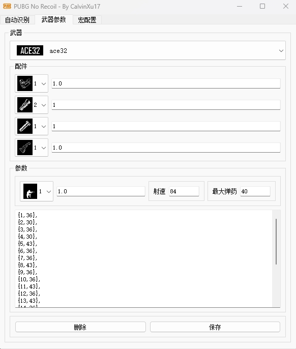

# PUBG罗技鼠标宏自动识别压枪

* C++实现，图形界面使用QT5.15.2，图像处理部分使用OpenCV4.5.1
* 自动识别的配件有：倍镜、枪口、握把，支持单击开镜与长按开镜两种，支持**自定义枪械参数**
* 仅靠截图识别并通过罗技的鼠标宏实现压枪，**不修改其他任何文件**！
* 因为我的鼠标只支持**GHUB**，所以目前仅测试了GHUB，后面会继续完成LGS的支持，不过需注意的是由于GHUB先天性缺陷，因此**不支持连点**
* 支持**1920x1080、2560x1080、2560x1440**分辨率，**2560x1440**可能部分情况下识别会有问题，因为我没有2k的显示器，所以请自行测试有问题在群里反馈
* 先放出成品测试，后面会继续开源
* 使用**单击开镜**时需将识别速率调高点，否则开镜后开枪过快会出现不压枪的情况，个人推荐长按开镜比较稳定

### 使用方式

* 下载后运行pubg.exe
* 点开武器参数选项卡，配置好参数后点击**应用**，此时会在C盘用户文件夹的Temp目录下生成weapon.lua脚本保存武器的参数
* 点开宏配置选项卡，勾选**自动识别**，点击**应用**，此时会在C盘用户文件夹的Temp目录下生成configc.lua脚本
* 继续在宏配置选项卡中点击下载脚本，并将该脚本复制到GHUB中
* 自动识别界面勾选Enable开启识别
* 可自行调节识别速率

### 软件界面

### 原理

最核心的原理即罗技鼠标宏中lua脚本的**dofile**函数，该函数可执行本地lua脚本文件的代码，因此可将识别的结果存储在本地的lua脚本中，在鼠标宏中通过**dofile**函数获取识别的结果进行压枪

### 免责声明

- **该程序仅供学习交流，严禁使用于任何商业用途，若产生利益纠纷，概不负责。**
- **请尊重作者的劳动成果，如需转载，请注明出处，谢谢！**
- **不可将此脚本二次创作后用于商业目的！**

### 交流群

欢迎加入技术交流QQ群 
