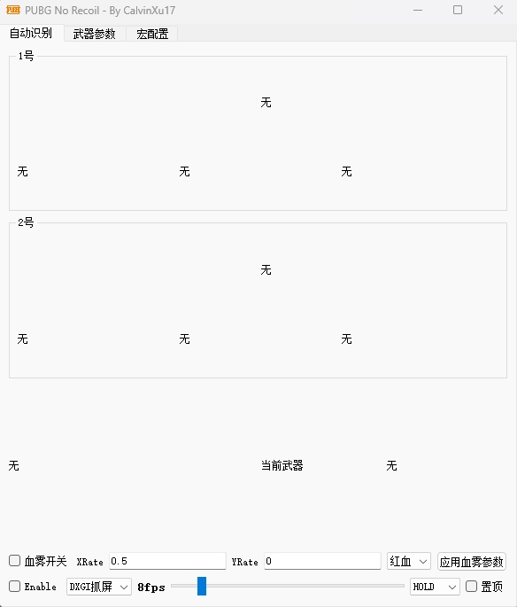

# OpenSource

无精力维护，已开源全部源码，有兴趣的自己拿去玩

除QT外需要自行编译OpenCV库

# PUBG罗技鼠标宏自动识别压枪V1.0

v1.0版本对原有旧版本做了进一步完善与升级，简化操作逻辑，更新特性如下：

- 武器识别改为背包界面武器文字识别，提高准确率
- 压枪逻辑调整，实现弹道通用（借鉴自[Soldier76](https://github.com/kiccer/Soldier76)项目）。对于实际用户不同的鼠标与游戏内的垂直灵敏度，可在宏配置界面自行修改垂直灵敏度以匹配当前电脑
- 资源文件调整优化，支持更多分辨率。目前提供了1080p与2k两个分辨率的配置，如果你的电脑分辨率不在此范围内，可以参考resource文件夹自行制作对应分辨率的资源文件
- 新版本仅在GHUB进行了测试，LGS不在支持范围内

## PUBG Auto

* C++实现，图形界面使用QT5.15.2，图像处理部分使用OpenCV4.5.1
* 自动识别的配件有：倍镜、枪口、握把，支持单击开镜与长按开镜两种，支持**自定义枪械参数**
* 仅靠截图识别并通过罗技的鼠标宏实现压枪，**不修改其他任何文件**！
* 支持**GHUB**，不过需注意的是由于GHUB lua api先天性缺陷，因此**GHUB不支持连点**
* 支持**1920x1080、2560x1440、3840x2160**分辨率
* 使用**单击开镜**时需将识别速率调高点，否则开镜后开枪过快会出现不压枪的情况，个人推荐**长按开镜**比较稳定
* ~~支持血雾修正~~
* 压枪循环间隔设置的越低，压枪越丝滑，但CPU占用率会更高，推荐默认10ms间隔

### 使用方式

* 下载后运行pubg.exe
* 点开武器参数选项卡，配置好参数后点击**保存**，此时会在C盘用户文件夹的Temp目录下生成weapon.lua脚本保存武器的参数
* 点开宏配置选项卡，修改垂直灵敏度为你自己游戏中的垂直灵敏度
* 默认弹道为**35开镜灵敏度**，计算公式未解决暂时不可修改，采用如下方式之一使宏正常压枪
  1. 修改游戏内开镜灵敏度为35与作者保持一致
  2. 自行调整垂直灵敏度，压枪幅度较大则调高，反之调低
* 点击宏配置选项卡**应用**，此时会在C盘用户文件夹的Temp目录下生成configc.lua脚本
* 继续在宏配置选项卡中点击**下载脚本**，并将该脚本复制到GHUB中
* 自动识别界面**勾选Enable**开启识别
* 可自行调节识别速率，推荐DXGI截屏速度快、CPU占用低

### 软件界面

### 原理

最核心的原理即罗技鼠标宏中lua脚本的**dofile**函数，该函数可执行本地lua脚本文件的代码，因此可将识别的结果存储在本地的lua脚本中，在鼠标宏中通过**dofile**函数获取识别的结果进行压枪

### 免责声明

- **该程序仅供学习交流，严禁使用于任何商业用途，若产生利益纠纷，概不负责。**
- **请尊重作者的劳动成果，如需转载，请注明出处，谢谢！**
- **不可将此脚本二次创作后用于商业目的！**

### 交流群

欢迎加入技术交流QQ群

  
